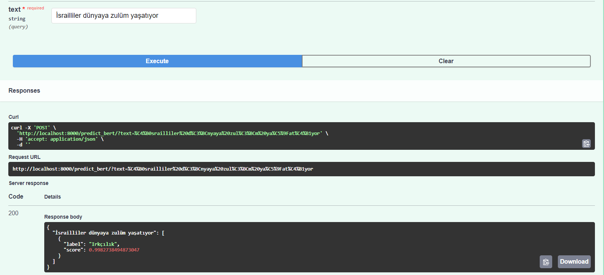

# Türkçe Siber Zorbalık Tespiti

Bu proje, Türkçe metinlerde siber zorbalık (cyberbullying) tespiti yapmak için çeşitli makine öğrenmesi modellerini eğitmeyi ve FastAPI kullanarak bu modelleri bir web servisi olarak sunmayı amaçlamaktadır.

## İçindekiler

- [Proje Açıklaması](#proje-açıklaması)
- [Kurulum](#kurulum)
- [Kullanım](#kullanım)
- [Örnek](#örnek-görünüm)
- [Katkıda Bulunma](#katkıda-bulunma)


## Proje Açıklaması

Bu proje, FastAPI ile bir REST API sunucusu oluşturulmuş olup, bu API aracılığıyla eğitimli modellerle tahminler yapılabilmektedir.

## Kurulum

Bu projeyi yerel ortamınıza kurmak için aşağıdaki adımları izleyin:

### 1. Depoyu klonlayın:
   ```bash
   git clone https://github.com/BilgeNurBekar/TurkishCyberbullyingFastAPI.git
   ``` 

### 2. Proje dizinine gidin:

    ```bash
    cd TurkishCyberbullyingFastAPI
    ```

### 3. Sanal ortamı oluşturun:

    ```bash
    python -m venv ./venv
    ```

### 4. Sanal ortamı etkinleştirin:

    - Windows için:

        ```bash
        .\venv\Scripts\activate
        ```

    - Unix veya MacOS için:

        ```bash
        source venv/bin/activate
        ```

### 5. Gerekli bağımlılıkları yükleyin:

    ```python
    pip install -r requirements.txt
    ```

### 6. HuggingFace platformundan modellere erişim:

    Çalışmada modellerin dosyaları üzerinden API kullanılmaktadır. Siber zorbalıkların tespiti için fine-tune edilmiş modelleri kodda değiştirerek kullanabilirsiniz:

    [BERTurk](https://huggingface.co/AIZinu/bert-turkish-based-cyberbullying-model)
    [ConvBERTurk](https://huggingface.co/AIZinu/convBERT-turk-based-cyberbullying)
    [DistilBERTurk](https://huggingface.co/AIZinu/distilBERT-turkish-based-cyberbullying-model)


## Kullanım:
 
### Docker ile Çalışma

   Proje dizininde `Dockerfile` ve gerekli dosyaların bulunduğundan emin olduktan sonra, Docker imajını oluşturun:

   ```bash
   docker build -t turkish-cyberbullying-fastapi .
   ```

   Docker Konteynerini Başlatma:

   ```bash
   docker run -d -p 8000:8000 turkish-cyberbullying-fastapi
   ```

## Örnek Görünüm:




## Katkıda Bulunma
Katkıda bulunmak isterseniz, lütfen aşağıdaki adımları takip edin:

Depoyu fork edin.

Yeni bir branch oluşturun: git checkout -b feature/ozellik-adi

Değişikliklerinizi yapın ve commit edin.

Pull request açın.

## Çalışmayı beğendiyseniz lütfen yıldızlamayı unutmayın :) 
